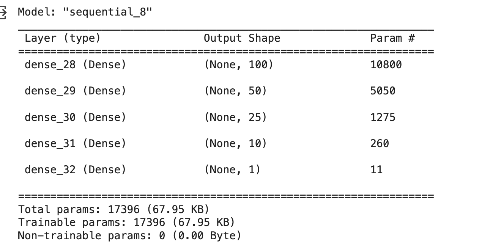

# Deep learning challenge

# Project overview

The purpose of this project is to create a binary classifier that can predict whether applicants will be successful if funded by Alphabet Soup.

# Data Preprocessing

* What variable(s) are the target(s) for your model?
"IS_SUCCESSFUL" is the target for the model since it will say wether the applican is successful or not.

* What variable(s) are the features for your model?
The remaining columns except "EIN" and "NAME".

* What variable(s) should be removed from the input data because they are neither targets nor features?
"EIN" and "NAME"

# Compiling, Training, and Evaluating the Model

* How many neurons, layers, and activation functions did you select for your neural network model, and why?

* Were you able to achieve the target model performance?
No, the model achieved an accuracy of %73.

* What steps did you take in your attempts to increase model performance?
Changing activation functions, adding layers, adding neurons and increasing the number of nodes, also, changing the cutoff value on the "APPLICATION_TYPE".

# Summary
The optimized model could not predict more than 73% in my scenario, however, I found out that by not removing the "NAME" column, accuracy could increase above the 75% mark and while exploring the data set this is easy to explain because some names are repeated, such as: "PARENT BOOSTER USA INC" with 1260, "TOPS CLUB INC" with 765 and a few others. I decided not to proceed with this approach to increase the accuracy because that would bias the results because of this outliers.
